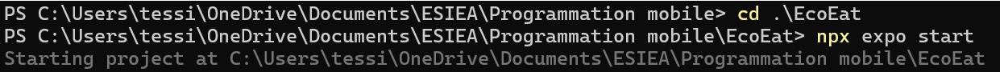
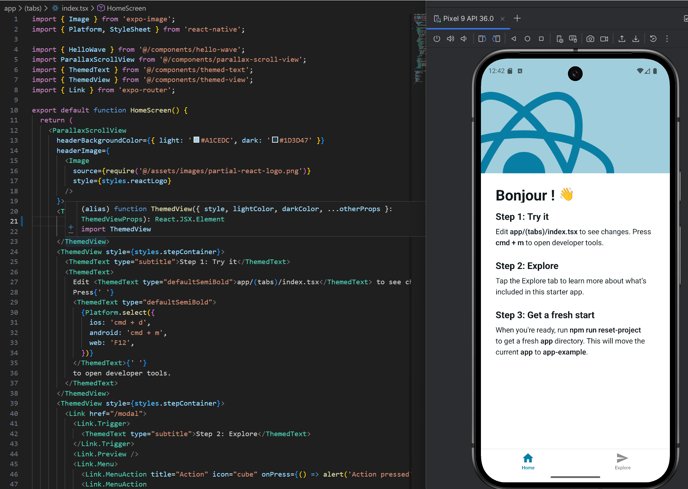
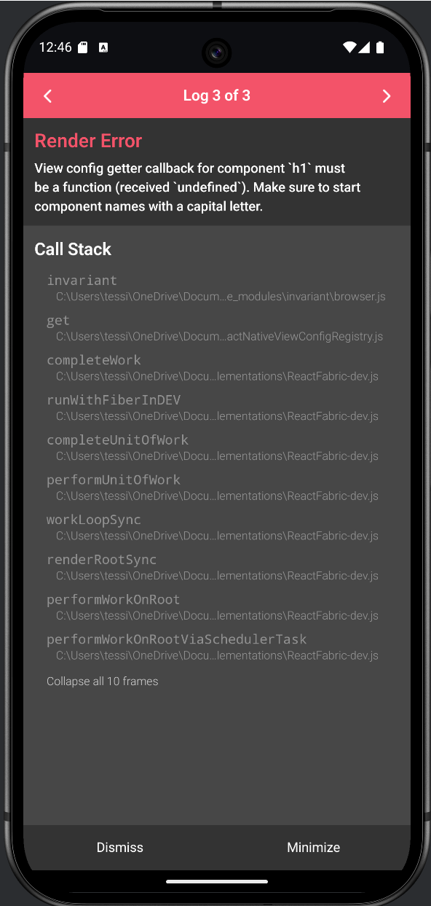
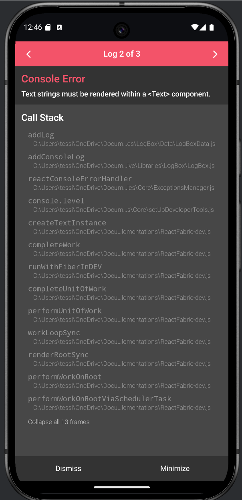
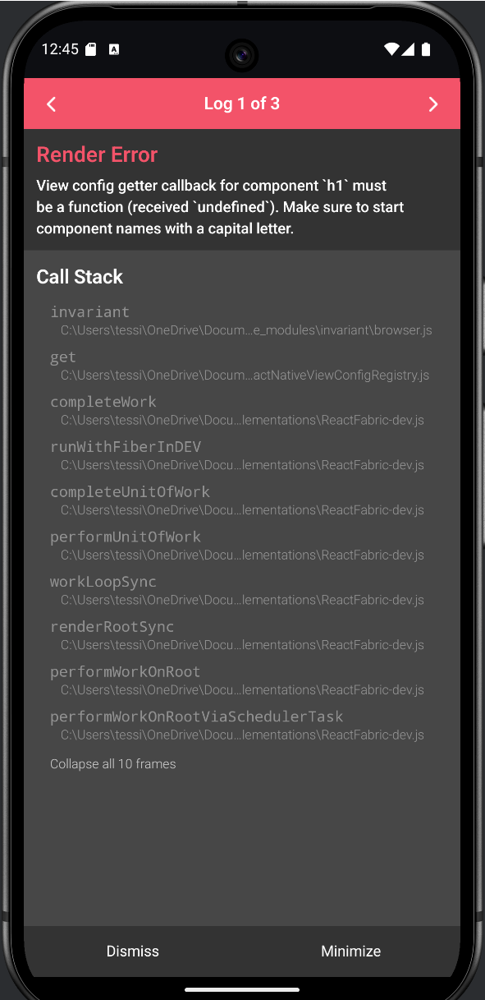
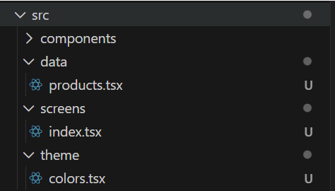
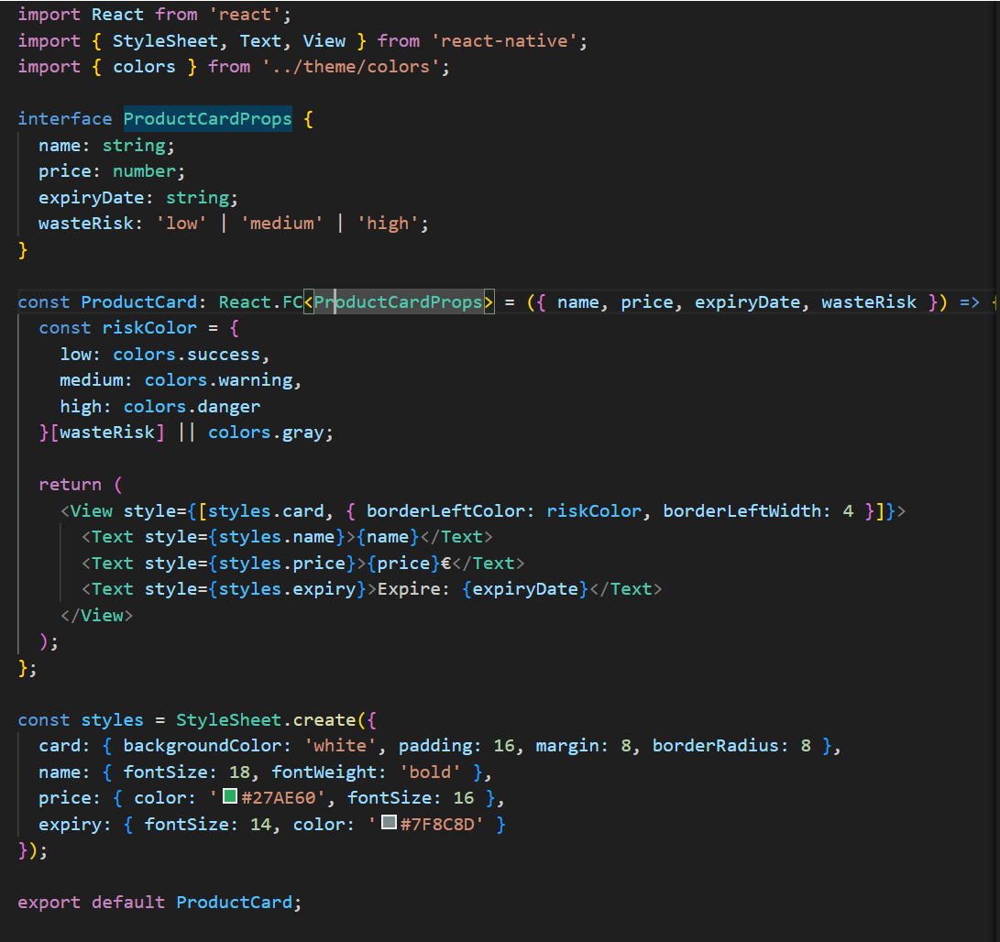
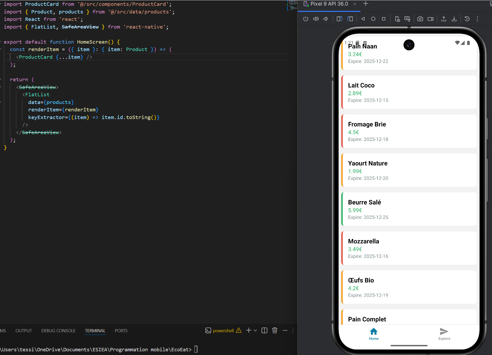

# TD1 — Rapport

## 1. Installation

Capture montrant l'installation et le démarrage du projet Expo.

## 2. Crash test volontaire

Captures montrant les tests de plantage volontaire pour reproduire l'erreur.

## 3. Erreur affichée

Captures montrant l'erreur "Text strings must be rendered within a <Text> component" et le call stack.

## 4. Architecture (clean)

Vue de l'arborescence du projet pour montrer l'organisation des dossiers. L'objectif étant de respecter la clean architecture

## 5. Composant ProductCard

Extrait du composant `ProductCard` montrant le rendu et les styles.

## 6. FlatList (résultat)

Affichage final de la liste de produits dans l'application mobile.

