# Rapport de Finalisation TD2 - EcoEat
## INF4079 – Programmation Mobile | ESIEA 2026

**Date** : Janvier 2026
**Sujet** : Navigation Avancée & Gestion d'État Local

---

## 1. Captures d'écran Essentielles

[cite_start]Cette section présente les preuves d'implémentation technique et visuelle demandées dans l'annexe [cite: 134-152].

### 1.1 Code Technique

**C1 : Import et déclaration de useRouter**
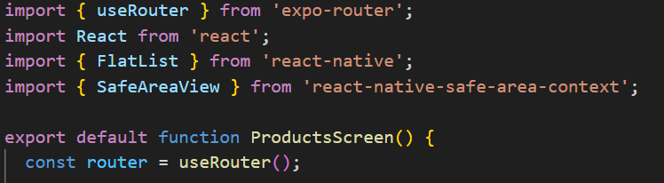

**C2 : Navigation vers les détails (router.push)**
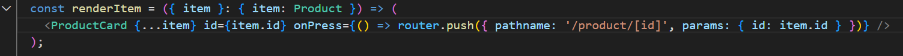

**C3 : Récupération des paramètres (useLocalSearchParams)**
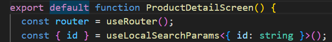

**C4 : Retour arrière (router.back)**
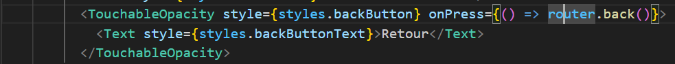

**C5 : Interactivité de la ProductCard**
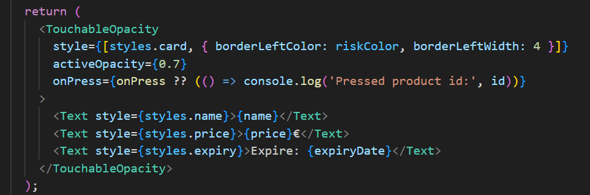

**C6 : État local (useState)**


**C7 : Logique de sélection (toggle)**
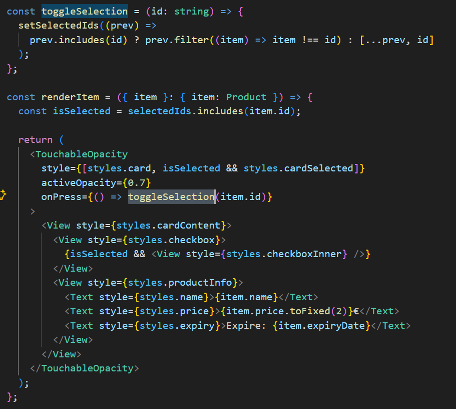

**C8 : Configuration de la Stack**
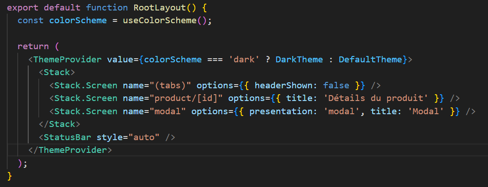

**C9 : Configuration des Tabs**
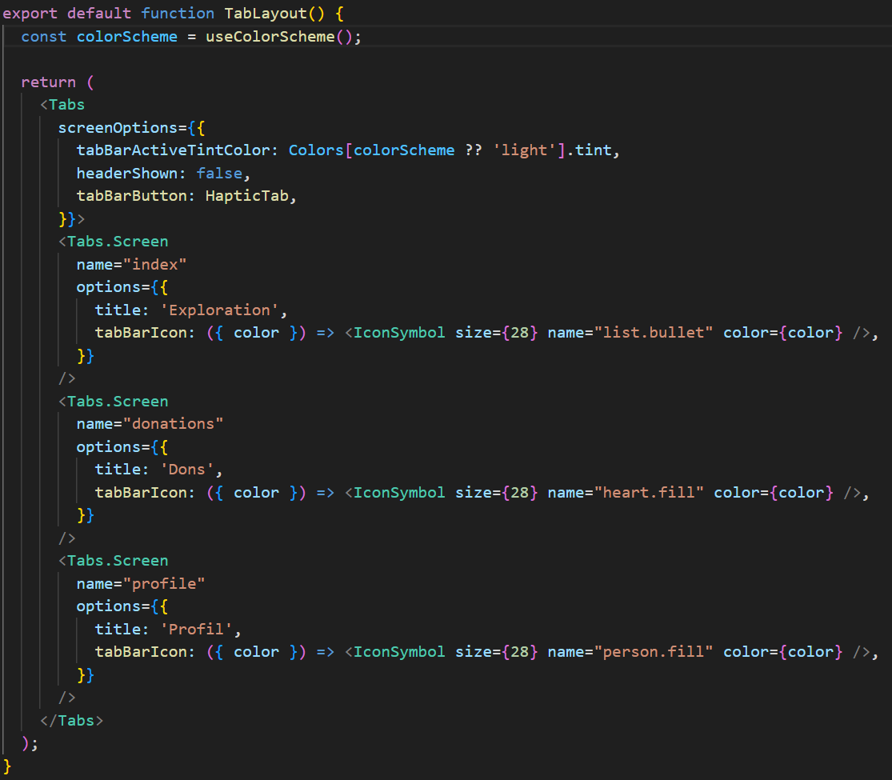

**C10 : Wrappers de routes**
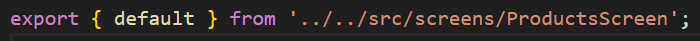


### 1.2 Interface Utilisateur

**I1 : Écran Exploration**
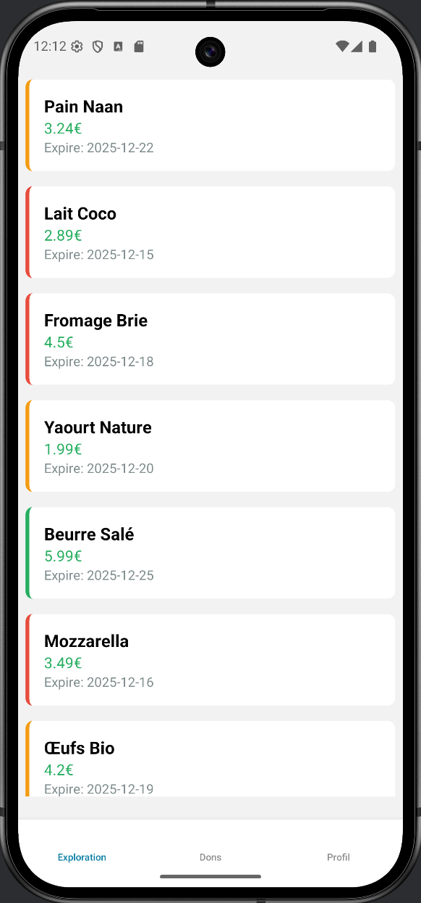

**I2 : Écran Détails produit**
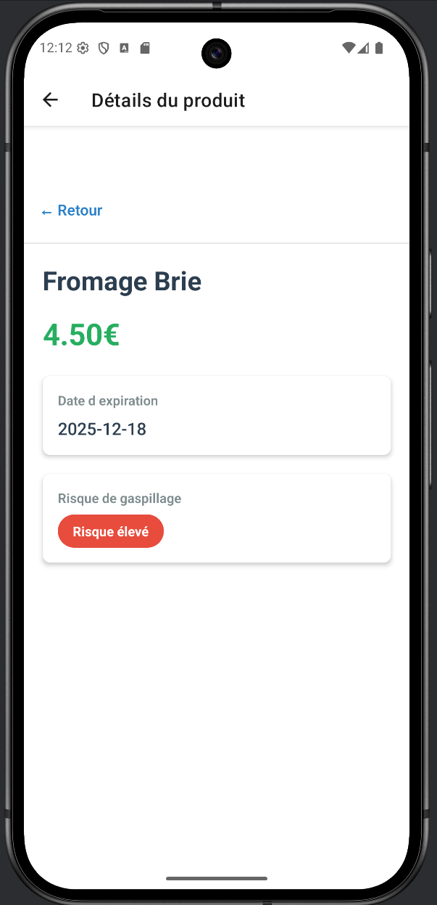

**I3 : Écran Dons**
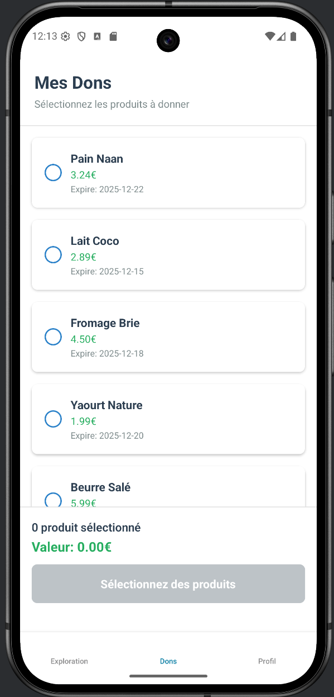

**I4 : Écran Profil**


**I5 : Navigation Tabs**
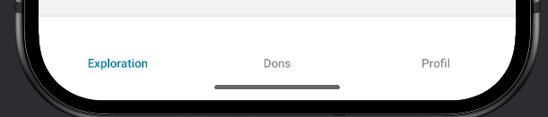

---

## 2. Implémentation des Tâches Restantes

Cette section détaille le code ajouté pour finaliser les fonctionnalités manquantes identifiées dans l'annexe "Annexe_TD2.md".

### Priorité 1 : Confirmation du don

Objectif : confirmer le don avec un message, puis réinitialiser la sélection.

**Implémentation (dans `src/screens/DonationsScreen.tsx`) :**

```tsx
import { Alert } from 'react-native';

const confirmDonation = () => {
  if (selectedIds.length === 0) return;

  Alert.alert(
    'Merci',
    `Don confirmé pour ${selectedIds.length} produit(s).`,
    [{ text: 'OK', onPress: () => setSelectedIds([]) }]
  );
};

```

### Priorité 3 : Améliorations (empty state)

Objectif : afficher un état vide clair quand la liste de produits est vide.

**Implémentation (dans `src/screens/ProductsScreen.tsx`) :**

```tsx
<FlatList
  data={products}
  renderItem={renderItem}
  keyExtractor={(item) => item.id}
  ListEmptyComponent={
    <View style={styles.emptyContainer}>
      <Text style={styles.emptyTitle}>Aucun produit disponible</Text>
      <Text style={styles.emptySubtitle}>Ajoutez des produits pour les voir ici.</Text>
    </View>
  }
  contentContainerStyle={products.length === 0 ? styles.emptyListContent : undefined}
/>
```

---

## 3. Réponses aux Questions de Validation

### Question 1 — Stack vs Tabs

La **Stack Navigation** empile les écrans (LIFO) : exemple dans EcoEat, **Exploration → Détails produit**.
La **Tab Navigation** permet de changer de section principale : exemple, passer de **Exploration** à **Dons** puis **Profil**.

### Question 2 — Paramètres de navigation

Il est déconseillé de passer un objet `Product` entier : risque de **données obsolètes (stale data)**, sérialisation plus lourde et incohérences si la source de données change. On passe plutôt l'`id`, puis on refait un `find` côté écran détails.

### Question 3 — Flexbox

Pour centrer parfaitement un élément :

- Axe principal (vertical en React Native par défaut) : `justifyContent: 'center'`
- Axe secondaire (horizontal) : `alignItems: 'center'`

### Question 4 — État local

`useState` suffit pour conserver l'état tant que le composant reste monté (ex : switch d'onglets), mais **pas après fermeture** de l'app. Pour persister : `AsyncStorage` (ou autre stockage local).

### Question 5 — TypeScript

Typer les props garantit un contrat clair, limite les erreurs et aide l'IDE : lors d'un refactoring ou d'un changement backend, les incohérences sont détectées avant l'exécution.

### Question 6 — Expo Router & file-based routing

Expo Router génère automatiquement les routes à partir des fichiers du dossier `app/` (ex : `app/product/[id].tsx` devient `/product/:id`). Avantage : moins de config manuelle, structure plus lisible.

### Question 7 — Robustesse & UX

Un produit peut être introuvable (id invalide, donnée supprimée). Sans gestion, l'écran peut crasher (`product` undefined). En le gérant, on affiche un message et un bouton retour.

### Question 8 — État local & cycle de vie

`useState` est un état en **mémoire (RAM)**, donc perdu à la fermeture. Un état **persisté** est sauvegardé sur disque et survit aux redémarrages.

### Question 9 — Séparation UI / navigation

La navigation ne doit pas être dans `ProductCard` pour respecter la responsabilité unique et garder le composant réutilisable. On passe une prop `onPress` depuis l'écran.

### Question 10 — Stack vs Tabs (UX)

Un écran de détails est contextuel (lié à une sélection), donc adapté à la Stack (avec retour). Les Tabs sont pour les sections fixes : Exploration / Dons / Profil.

---

## 4. Bilan de Validation

- [x] Stack Navigation : ProductCard cliquable, route dynamique, retour arrière.
- [x] Tabs Navigation : 3 onglets, titres + icônes.
- [x] DonationsScreen : sélection multiple, compteur/total, confirmation via `Alert`.
- [x] ProfileScreen : mise en page alignée (Flexbox).
- [x] Qualité : typage TypeScript, pas d'HTML, pas d'erreurs TypeScript.