# Rapport de Finalisation TD3 - EcoEat
## INF4079 – Programmation Mobile | ESIEA 2026

**Date** : Janvier 2026
**Sujet** : Context API, État Global & Persistance

---

## 1. Captures d'écran Essentielles

Cette section présente les preuves d'implémentation technique et visuelle demandées dans l'annexe.

### 1.1 Code Technique

**C1 : createContext et AppContextType**

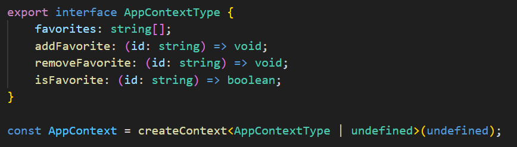

**C2 : Provider avec useState favorites**

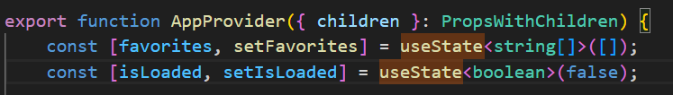

**C3 : AppProvider intégré dans app/_layout.tsx**

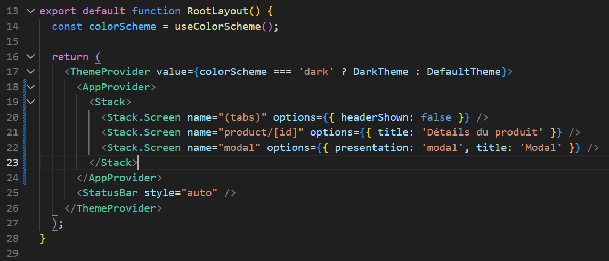

**C4 : useContext dans ProductCard**

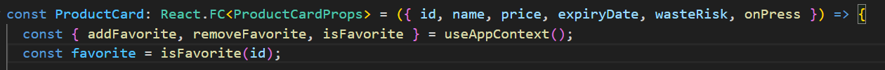

**C5 : Hook useSearch créé**

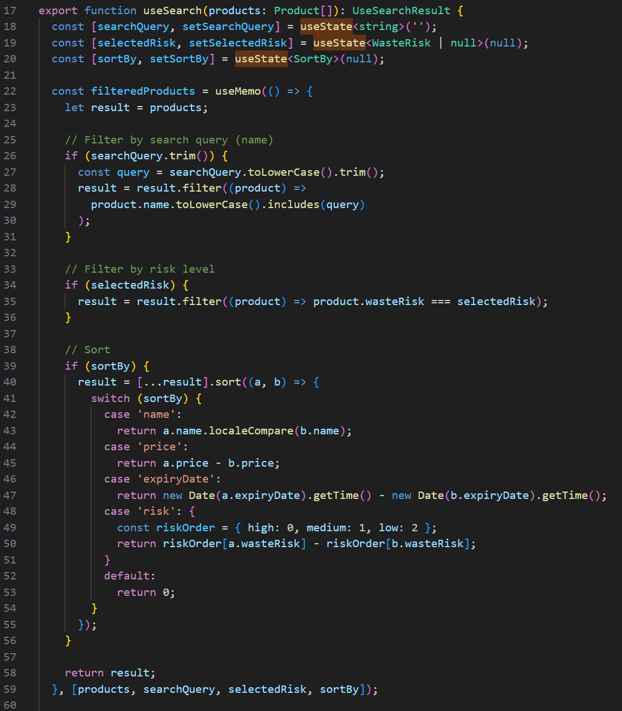

**C6 : useMemo filteredProducts dans useSearch**

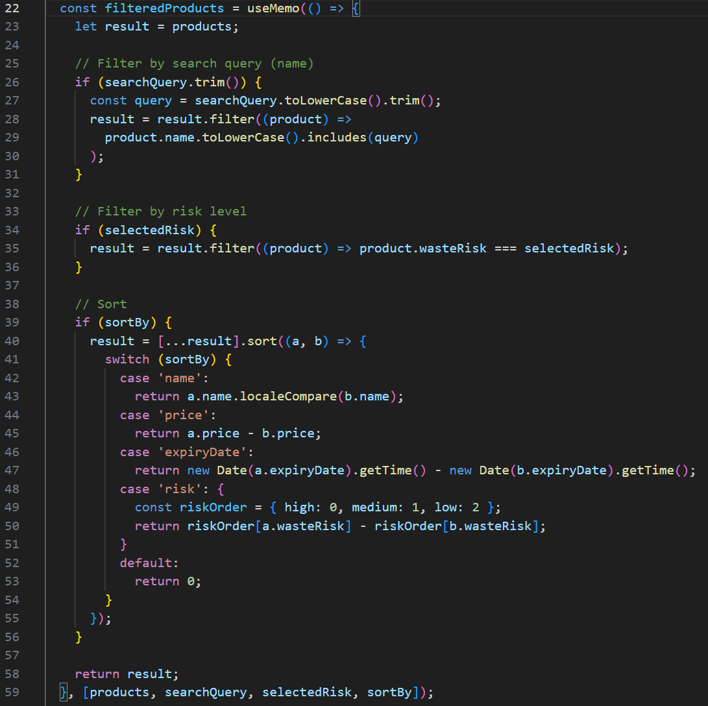

**C7 : TextInput et filtres dans ProductsScreen**

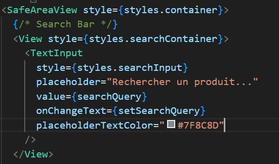

**C8 : Service storage.ts avec saveFavorites/loadFavorites**

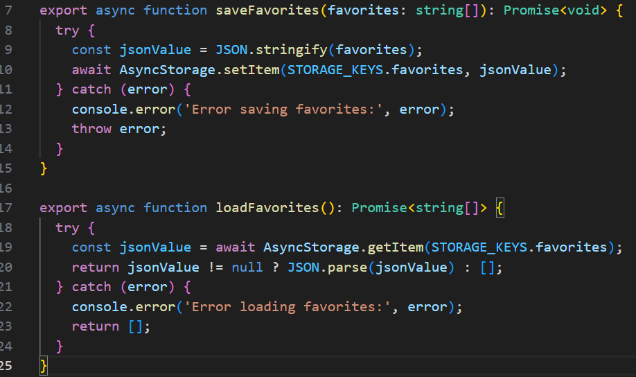

**C9 : AsyncStorage useEffect dans AppContext**

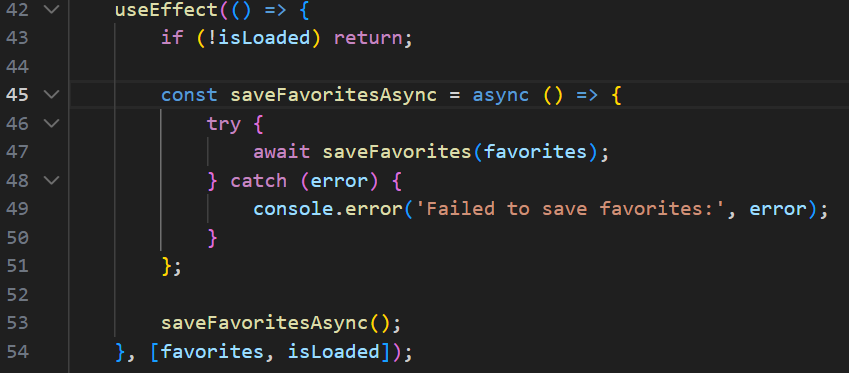

**C10 : Tri implémenté dans useSearch**

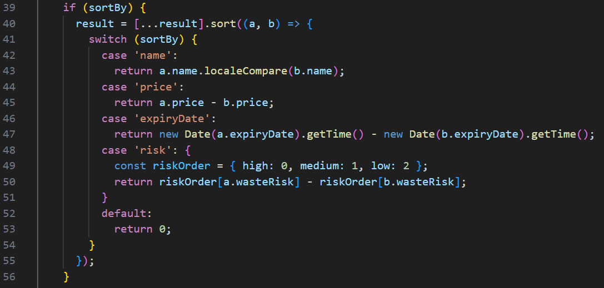

### 1.2 Interface Utilisateur

**I1 : Écran Exploration avec barre de recherche et filtres**

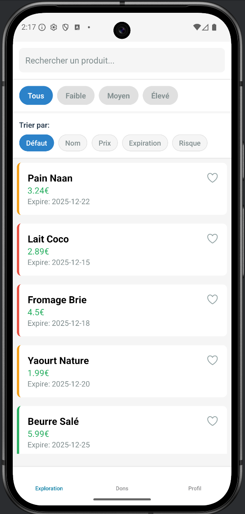

**I2 : ProductCard avec icône cœur (favori/non favori)**

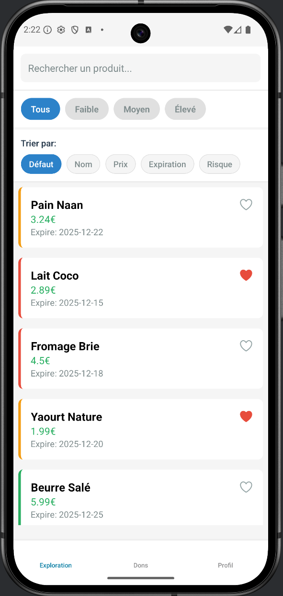

**I3 : Recherche et filtres actifs (résultats filtrés)**

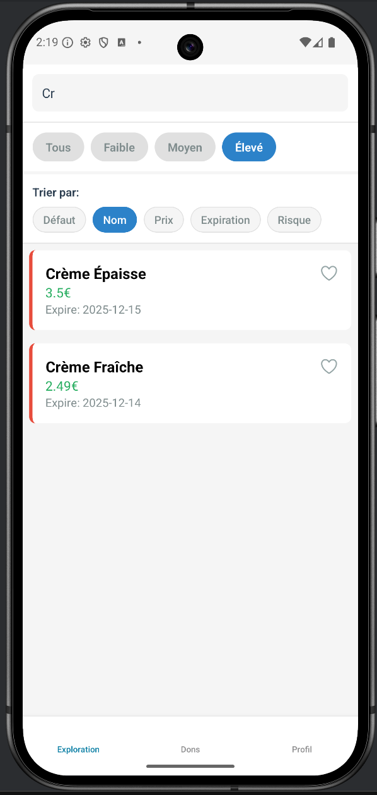

**I4 : Profil avec nombre de favoris affiché**

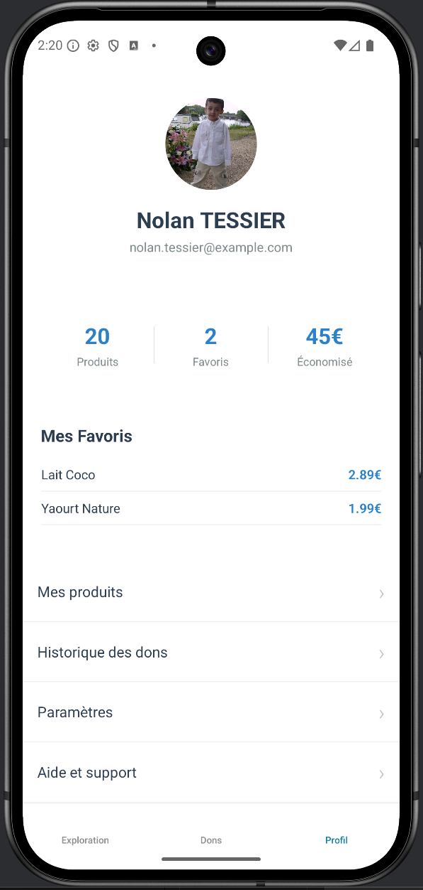

**I5 : Test persistance (favoris conservés après fermeture)**


---

## 2. Implémentation des Tâches

Cette section détaille le code ajouté pour implémenter les fonctionnalités du TD3.

### Priorité 1 : Context API (État Global)

#### 1. Création du Context

**Fichier** : `src/context/AppContext.tsx`

**Interface et Context :**

```tsx
import React, { createContext, useState, useContext, ReactNode, useEffect } from 'react';
import { loadFavorites, saveFavorites } from '../services/storage';

interface AppContextType {
  favorites: string[];
  addFavorite: (id: string) => void;
  removeFavorite: (id: string) => void;
  isFavorite: (id: string) => boolean;
}

const AppContext = createContext<AppContextType | undefined>(undefined);
```

**Provider avec logique :**

```tsx
export const AppProvider = ({ children }: { children: ReactNode }) => {
  const [favorites, setFavorites] = useState<string[]>([]);
  const [isLoaded, setIsLoaded] = useState<boolean>(false);

  // Chargement des favoris au démarrage
  useEffect(() => {
    const initFavorites = async () => {
      try {
        const storedFavorites = await loadFavorites();
        setFavorites(storedFavorites);
      } catch (error) {
        console.error('Failed to load favorites:', error);
      } finally {
        setIsLoaded(true);
      }
    };
    initFavorites();
  }, []);

  // Sauvegarde automatique des favoris
  useEffect(() => {
    if (!isLoaded) return;
    const saveFavoritesAsync = async () => {
      try {
        await saveFavorites(favorites);
      } catch (error) {
        console.error('Failed to save favorites:', error);
      }
    };
    saveFavoritesAsync();
  }, [favorites, isLoaded]);

  const addFavorite = (id: string) => {
    setFavorites((prev) => [...prev, id]);
  };

  const removeFavorite = (id: string) => {
    setFavorites((prev) => prev.filter((fav) => fav !== id));
  };

  const isFavorite = (id: string) => favorites.includes(id);

  return (
    <AppContext.Provider value={{ favorites, addFavorite, removeFavorite, isFavorite }}>
      {children}
    </AppContext.Provider>
  );
};

export const useAppContext = () => {
  const context = useContext(AppContext);
  if (!context) {
    throw new Error('useAppContext must be used within AppProvider');
  }
  return context;
};
```

#### 2. Intégration dans app/_layout.tsx

```tsx
import { AppProvider } from '@/src/context/AppContext';

export default function RootLayout() {
  return (
    <AppProvider>
      <Stack>
        <Stack.Screen name="(tabs)" options={{ headerShown: false }} />
        <Stack.Screen name="product/[id]" options={{ presentation: 'modal' }} />
      </Stack>
    </AppProvider>
  );
}
```

### Priorité 2 : Système de Favoris

#### 3. Adaptation de ProductCard avec icône cœur

**Fichier** : `src/components/ProductCard.tsx`

```tsx
import { Ionicons } from '@expo/vector-icons';
import { useAppContext } from '../context/AppContext';
import { colors } from '../theme/colors';

export const ProductCard = ({ product, onPress }: ProductCardProps) => {
  const { isFavorite, addFavorite, removeFavorite } = useAppContext();
  const favorite = isFavorite(product.id);

  const toggleFavorite = () => {
    if (favorite) {
      removeFavorite(product.id);
    } else {
      addFavorite(product.id);
    }
  };

  return (
    <TouchableOpacity style={styles.card} onPress={onPress}>
      {/* Contenu de la carte */}
      
      <Pressable 
        style={styles.favoriteButton} 
        onPress={(e) => {
          e.stopPropagation();
          toggleFavorite();
        }}
      >
        <Ionicons
          name={favorite ? 'heart' : 'heart-outline'}
          size={24}
          color={favorite ? colors.error : colors.textSecondary}
        />
      </Pressable>
    </TouchableOpacity>
  );
};
```

#### 4. Affichage des favoris dans ProfileScreen

**Fichier** : `src/screens/ProfilScreen.tsx`

```tsx
import { useAppContext } from '../context/AppContext';
import { products } from '../data/products';

export const ProfilScreen = () => {
  const { favorites } = useAppContext();

  return (
    <SafeAreaView style={styles.container}>
      {/* Stats */}
      <View style={styles.statsContainer}>
        <View style={styles.stat}>
          <Text style={styles.statValue}>{favorites.length}</Text>
          <Text style={styles.statLabel}>Favoris</Text>
        </View>
      </View>

      {/* Liste des favoris (optionnel) */}
      {favorites.length > 0 && (
        <View style={styles.favoritesSection}>
          <Text style={styles.sectionTitle}>Mes Favoris</Text>
          {favorites.slice(0, 5).map((favId) => {
            const product = products.find((p) => p.id === favId);
            return product ? (
              <Text key={favId} style={styles.favoriteItem}>
                • {product.name}
              </Text>
            ) : null;
          })}
          {favorites.length > 5 && (
            <Text style={styles.moreText}>
              +{favorites.length - 5} autre(s)
            </Text>
          )}
        </View>
      )}
    </SafeAreaView>
  );
};
```

### Priorité 3 : Filtres et Recherche

#### 5. Création du Hook useSearch

**Fichier** : `src/hooks/useSearch.ts`

```tsx
import { useState, useMemo } from 'react';
import { Product } from '../data/products';

type SortOption = 'name' | 'price' | 'expiryDate' | 'risk' | null;
type RiskLevel = 'low' | 'medium' | 'high' | null;

export const useSearch = (products: Product[]) => {
  const [searchQuery, setSearchQuery] = useState<string>('');
  const [selectedRisk, setSelectedRisk] = useState<RiskLevel>(null);
  const [sortBy, setSortBy] = useState<SortOption>(null);

  const filteredProducts = useMemo(() => {
    let result = [...products];

    // Filtrage par texte
    if (searchQuery.trim()) {
      const query = searchQuery.toLowerCase();
      result = result.filter(
        (p) =>
          p.name.toLowerCase().includes(query) ||
          p.category.toLowerCase().includes(query)
      );
    }

    // Filtrage par risque
    if (selectedRisk) {
      result = result.filter((p) => p.wasteRisk === selectedRisk);
    }

    // Tri
    if (sortBy) {
      result.sort((a, b) => {
        switch (sortBy) {
          case 'name':
            return a.name.localeCompare(b.name);
          
          case 'price':
            const priceA = parseFloat(a.price.replace('€', ''));
            const priceB = parseFloat(b.price.replace('€', ''));
            return priceA - priceB;
          
          case 'expiryDate':
            return new Date(a.expiryDate).getTime() - new Date(b.expiryDate).getTime();
          
          case 'risk':
            const riskOrder = { low: 1, medium: 2, high: 3 };
            return riskOrder[a.wasteRisk] - riskOrder[b.wasteRisk];
          
          default:
            return 0;
        }
      });
    }

    return result;
  }, [products, searchQuery, selectedRisk, sortBy]);

  return {
    searchQuery,
    setSearchQuery,
    selectedRisk,
    setSelectedRisk,
    sortBy,
    setSortBy,
    filteredProducts,
  };
};
```

#### 6. Adaptation de ProductsScreen

**Fichier** : `src/screens/ProductsScreen.tsx`

```tsx
import { useSearch } from '../hooks/useSearch';

export const ProductsScreen = () => {
  const router = useRouter();
  const {
    searchQuery,
    setSearchQuery,
    selectedRisk,
    setSelectedRisk,
    sortBy,
    setSortBy,
    filteredProducts,
  } = useSearch(products);

  return (
    <SafeAreaView style={styles.container}>
      {/* Barre de recherche */}
      <TextInput
        style={styles.searchInput}
        placeholder="Rechercher un produit..."
        value={searchQuery}
        onChangeText={setSearchQuery}
      />

      {/* Filtres par risque */}
      <View style={styles.filtersContainer}>
        <Text style={styles.filterLabel}>Risque :</Text>
        <ScrollView horizontal showsHorizontalScrollIndicator={false}>
          <Pressable
            style={[styles.filterChip, !selectedRisk && styles.filterChipActive]}
            onPress={() => setSelectedRisk(null)}
          >
            <Text style={styles.filterChipText}>Tous</Text>
          </Pressable>
          {['low', 'medium', 'high'].map((risk) => (
            <Pressable
              key={risk}
              style={[styles.filterChip, selectedRisk === risk && styles.filterChipActive]}
              onPress={() => setSelectedRisk(risk as RiskLevel)}
            >
              <Text style={styles.filterChipText}>
                {risk === 'low' ? 'Faible' : risk === 'medium' ? 'Moyen' : 'Élevé'}
              </Text>
            </Pressable>
          ))}
        </ScrollView>
      </View>

      {/* Options de tri */}
      <View style={styles.sortContainer}>
        <Text style={styles.filterLabel}>Trier par :</Text>
        <ScrollView horizontal showsHorizontalScrollIndicator={false}>
          {[
            { key: null, label: 'Défaut' },
            { key: 'name', label: 'Nom' },
            { key: 'price', label: 'Prix' },
            { key: 'expiryDate', label: 'Expiration' },
            { key: 'risk', label: 'Risque' },
          ].map((option) => (
            <Pressable
              key={option.key ?? 'default'}
              style={[styles.sortButton, sortBy === option.key && styles.sortButtonActive]}
              onPress={() => setSortBy(option.key as SortOption)}
            >
              <Text style={styles.sortButtonText}>{option.label}</Text>
            </Pressable>
          ))}
        </ScrollView>
      </View>

      {/* Liste des produits */}
      <FlatList
        data={filteredProducts}
        renderItem={renderItem}
        keyExtractor={(item) => item.id}
        ListEmptyComponent={
          <View style={styles.emptyContainer}>
            <Text style={styles.emptyTitle}>Aucun produit trouvé</Text>
            <Text style={styles.emptySubtitle}>
              Essayez de modifier vos filtres ou votre recherche.
            </Text>
          </View>
        }
      />
    </SafeAreaView>
  );
};
```

### Priorité 5 : AsyncStorage (Persistance)

#### 7. Service de Stockage

**Fichier** : `src/services/storage.ts`

```tsx
import AsyncStorage from '@react-native-async-storage/async-storage';

const STORAGE_KEYS = {
  favorites: '@EcoEat:favorites',
};

export const saveFavorites = async (favorites: string[]): Promise<void> => {
  try {
    const jsonValue = JSON.stringify(favorites);
    await AsyncStorage.setItem(STORAGE_KEYS.favorites, jsonValue);
  } catch (error) {
    console.error('Error saving favorites:', error);
    throw error;
  }
};

export const loadFavorites = async (): Promise<string[]> => {
  try {
    const jsonValue = await AsyncStorage.getItem(STORAGE_KEYS.favorites);
    return jsonValue != null ? JSON.parse(jsonValue) : [];
  } catch (error) {
    console.error('Error loading favorites:', error);
    return [];
  }
};

export const clearFavorites = async (): Promise<void> => {
  try {
    await AsyncStorage.removeItem(STORAGE_KEYS.favorites);
  } catch (error) {
    console.error('Error clearing favorites:', error);
    throw error;
  }
};
```

---

## 3. Réponses aux Questions de Validation

### Question 1 — Context API vs Props Drilling

**Props Drilling** : passer des props à travers plusieurs niveaux de composants même si les intermédiaires n'en ont pas besoin (ex: App → Screen → Card → Button).

**Context API** : créer un état global accessible directement par n'importe quel composant via `useContext`.

**Quand utiliser Context API ?** Quand plusieurs composants éloignés ont besoin des mêmes données (favoris, utilisateur, thème).

**Exemple dans EcoEat** : Les favoris sont utilisés dans `ProductCard`, `ProductsScreen` et `ProfileScreen`. Sans Context, il faudrait passer `favorites`, `addFavorite`, `removeFavorite` depuis `app/_layout.tsx` à travers tous les écrans intermédiaires.

### Question 2 — Performance avec Context

Séparer les contextes évite les **re-renders inutiles**. Si tout est dans un seul `AppContext` énorme, changer une seule valeur (ex: `theme`) provoque le re-render de **tous** les consommateurs (même ceux qui n'utilisent que `favorites`).

**Risques de performance** :
- Re-renders en cascade
- Calculs lourds répétés
- Interface qui lag

**Solution** : créer `FavoritesContext`, `ThemeContext`, `UserContext` séparés.

### Question 3 — Limitations AsyncStorage

**AsyncStorage** :
- Stockage simple clé/valeur (strings)
- Limite ~6MB selon les OS
- Non chiffré (données visibles)
- Asynchrone (require async/await)

**SecureStore** :
- Chiffrement natif (Keychain iOS, Keystore Android)
- Pour données sensibles (tokens, mots de passe)
- Plus sécurisé mais plus lent

**Exemples** :
- AsyncStorage : favoris, préférences UI, cache
- SecureStore : token JWT, credentials, clés API

### Question 4 — Hooks Personnalisés

**Avantages** :
- **Réutilisabilité** : même logique dans plusieurs composants
- **Séparation des responsabilités** : logique vs UI
- **Testabilité** : tester la logique indépendamment
- **Lisibilité** : composant plus simple

**Exemple** : `useSearch` encapsule recherche + filtres + tri. Sans hook, tout ce code serait dupliqué dans chaque écran ou mélangé à l'UI.

### Question 5 — useMemo et Performance

`useMemo` **mémorise** le résultat d'un calcul coûteux et ne le recalcule que si les dépendances changent.

**Quand réexécuté ?** Uniquement si `products`, `searchQuery`, `selectedRisk` ou `sortBy` changent.

**Sans useMemo** : le filtrage/tri s'exécuterait à **chaque render** (même pour un clic sur un bouton non lié), causant lag sur grandes listes (1000+ items).

### Question 6 — État Global vs État Local

**État local (useState)** : données propres à un composant, non partagées.
**Exemple** : `selectedIds` dans `DonationsScreen` (sélection temporaire).

**État global (Context)** : données partagées entre plusieurs composants.
**Exemple** : `favorites` dans `AppContext` (utilisé dans ProductCard, ProductsScreen, ProfileScreen).

**Règle** : commencer local, passer global si besoin de partage.

### Question 7 — Cycle de Vie et Persistance

**Chargement** : au **montage** du Provider (`useEffect` avec `[]`), avant le premier render.

**Sauvegarde** : à chaque **changement** de `favorites` (`useEffect` avec `[favorites]`).

**Rôle des useEffect** :
- 1er useEffect : `loadFavorites()` → initialise l'état
- 2e useEffect : `saveFavorites(favorites)` → synchronise avec le stockage

**Guard `isLoaded`** : évite de sauvegarder pendant le chargement initial (sinon on écraserait avec `[]`).

### Question 8 — Gestion d'Erreurs AsyncStorage

**Pourquoi try/catch ?**
- Permissions refusées
- Stockage plein
- Corruption de données
- JSON invalide

**Réactions** :
- Log l'erreur (`console.error`)
- Fallback sur valeur par défaut (`[]`)
- Optionnel : afficher Toast/Alert à l'utilisateur
- Ne jamais crasher l'app

### Question 9 — Sérialisation JSON

**AsyncStorage stocke uniquement des strings**. Pour sauvegarder un tableau/objet :
- `JSON.stringify(data)` avant `setItem`
- `JSON.parse(string)` après `getItem`

**Sans stringify/parse** : `[object Object]` serait sauvegardé, rendant les données illisibles.

**Limite** : JSON ne supporte pas Date, Function, undefined → besoin de transformation manuelle.

### Question 10 — Évolution Architecture

**Limites Context + AsyncStorage** :
- Performance (1000+ produits, nombreux consommateurs)
- Synchronisation multi-utilisateurs impossible
- Pas de cache intelligent
- Logique complexe difficile à maintenir

**Alternatives** :
- **Zustand/Redux** : gestion d'état plus performante (sélecteurs, middleware)
- **React Query** : cache, invalidation, refetch automatique
- **Backend + API** : synchronisation cloud, partage entre devices
- **SQLite** : requêtes complexes, relations, indexation

**Seuil** : au-delà de 5-10 contextes ou 100+ composants, envisager une solution plus robuste.

---

## 4. Bilan de Validation

### Context API
- [x] Context créé avec `AppContextType`
- [x] Provider intégré dans `app/_layout.tsx`
- [x] Hook `useAppContext` avec erreur si hors Provider
- [x] Fonctions `addFavorite`, `removeFavorite`, `isFavorite` opérationnelles

### Favoris
- [x] Icône cœur Ionicons dans ProductCard
- [x] Toggle favori avec stopPropagation
- [x] Nombre de favoris affiché dans ProfileScreen
- [x] Liste des favoris avec fallback si produit non trouvé
- [x] Persistance avec AsyncStorage fonctionnelle

### Filtres et Recherche
- [x] Hook `useSearch` créé avec TypeScript
- [x] Barre de recherche `TextInput` fonctionnelle
- [x] Filtres par risque (Tous/Faible/Moyen/Élevé)
- [x] Combinaison recherche + filtres + tri
- [x] `useMemo` pour optimisation des calculs

### Tri
- [x] Tri par nom (alphabétique)
- [x] Tri par prix (parsing `parseFloat`)
- [x] Tri par date d'expiration (`getTime()`)
- [x] Tri par risque (ordre custom)
- [x] UI de sélection du tri

### Persistance
- [x] Service `storage.ts` créé
- [x] `saveFavorites` avec `JSON.stringify`
- [x] `loadFavorites` avec `JSON.parse` et fallback
- [x] Chargement au montage du Provider
- [x] Sauvegarde automatique à chaque changement
- [x] Guard `isLoaded` pour éviter écrasement
- [x] Gestion d'erreurs avec try/catch
- [x] Test de persistance validé (fermeture/ouverture app)

### Qualité
- [x] Aucune erreur console
- [x] Code TypeScript typé (interfaces, types)
- [x] Hooks optimisés (`useMemo`, `useCallback` si nécessaire)
- [x] Architecture Clean respectée
- [x] Séparation logique/UI (hooks/components/screens)
- [x] Package AsyncStorage installé
