# Rapport de Finalisation TD4 - EcoEat
## INF4079 – Programmation Mobile | ESIEA 2026

**Date** : Janvier 2026
**Sujet** : Firebase Firestore & Flux Asynchrones

---

## 1. Captures d'écran Essentielles

Cette section présente les preuves d'implémentation technique et visuelle demandées.

### 1.1 Code Technique

**C1 : Configuration Firebase (firebase.ts)**
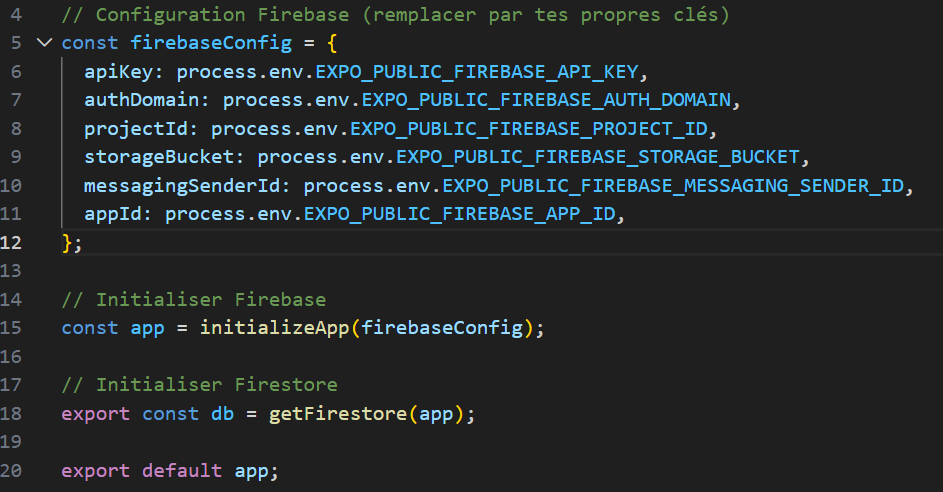

**C2 : Interface Product avec isDonation**
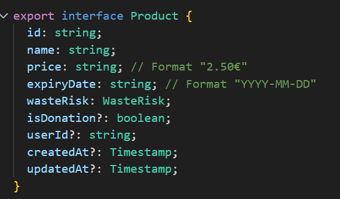

**C3 : Service productsService.ts - createProduct**
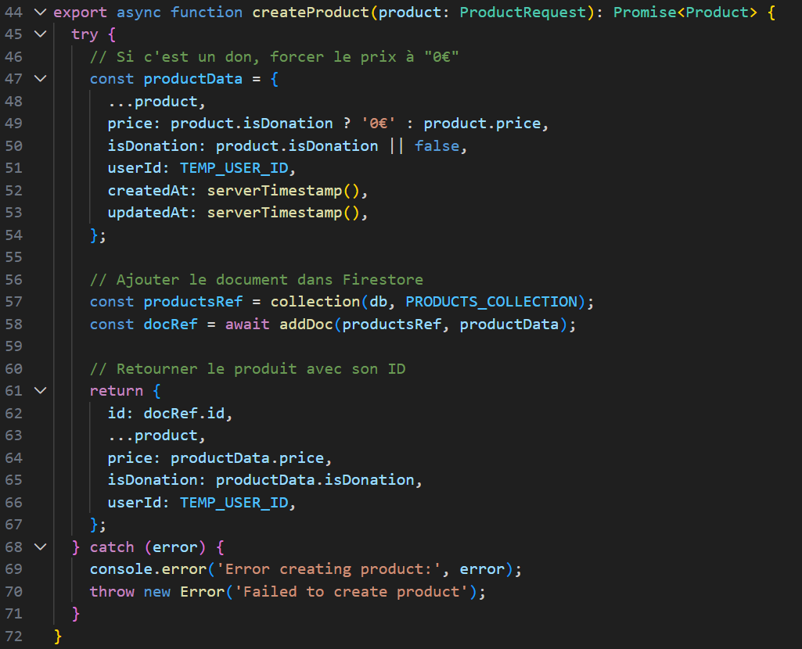

**C4 : Service productsService.ts - fetchProducts**
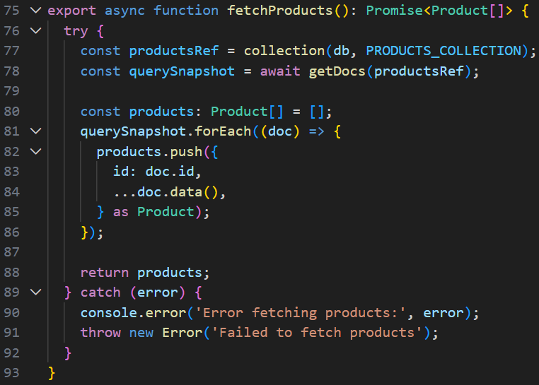

**C5 : Service productsService.ts - updateProduct / deleteProduct**
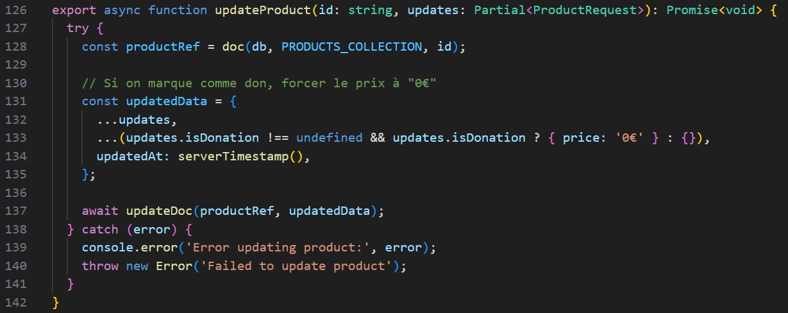
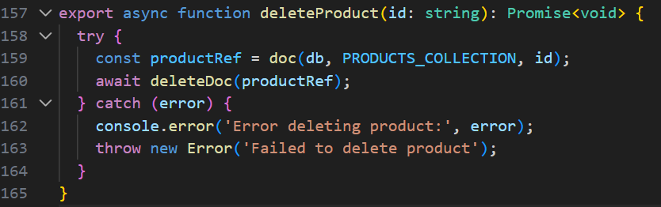

**C6 : Hook useProducts - États et chargement**
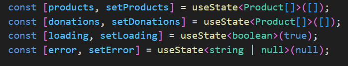

**C7 : Hook useProducts - Fonctions CRUD**
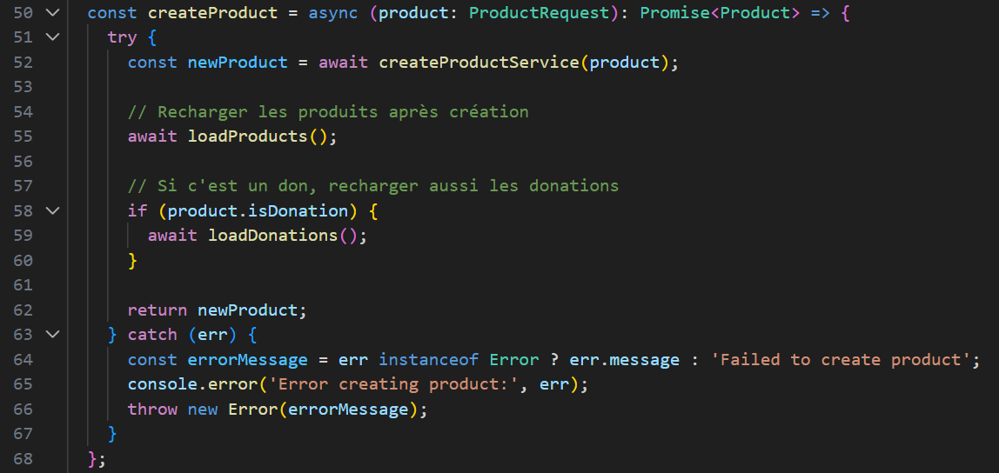
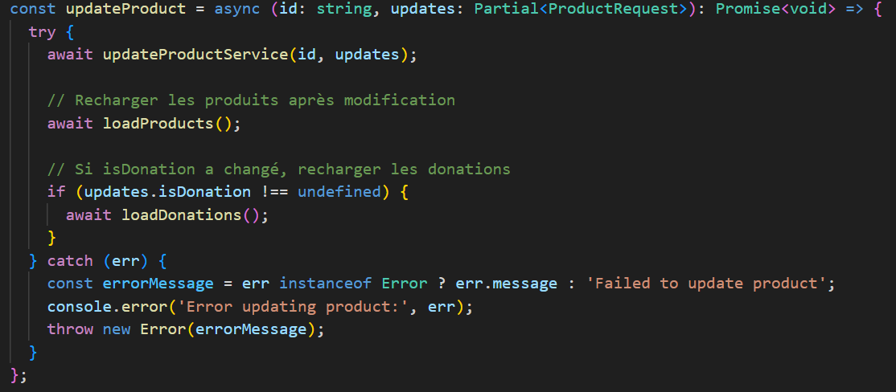


**C8 : ProductCard avec prop isDonation**
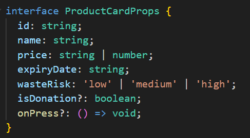


**C9 : ProductsScreen - useProducts et badge "En don"**
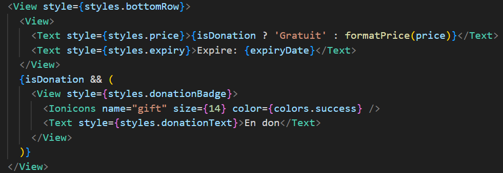

**C10 : DonationsScreen - Formulaire CRUD**
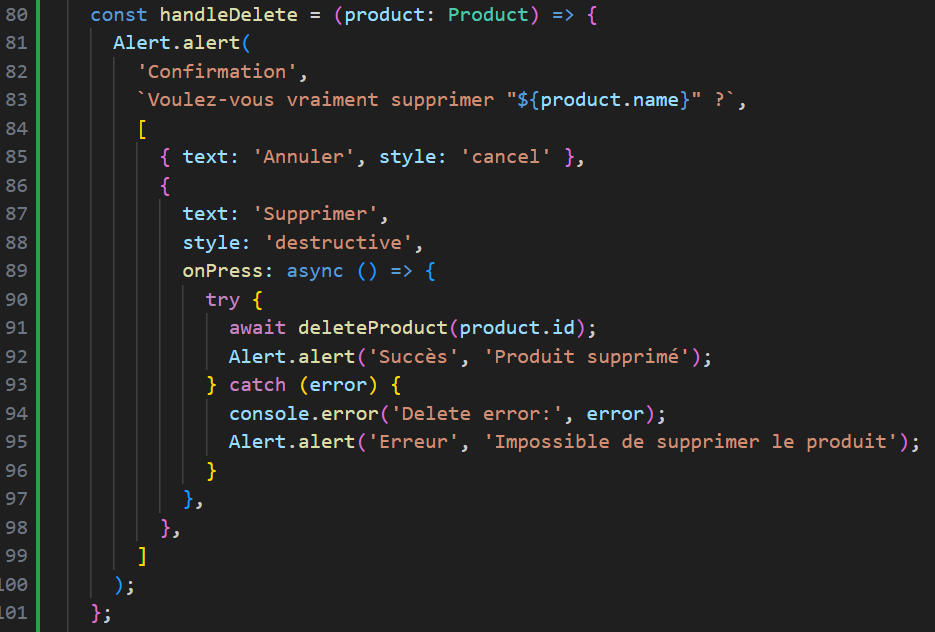

### 1.2 Interface Utilisateur

**I1 : Écran Exploration avec produits Firebase**
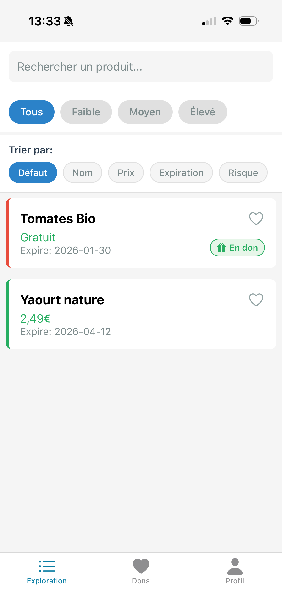

**I2 : Écran Dons avec formulaire CRUD**
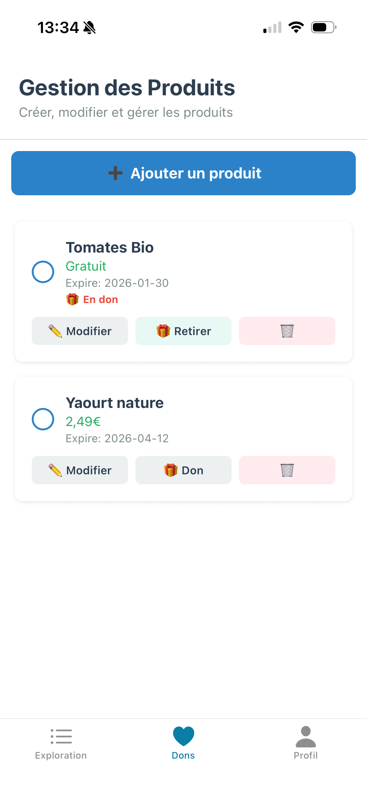

**I3 : Création d'un produit (formulaire)**
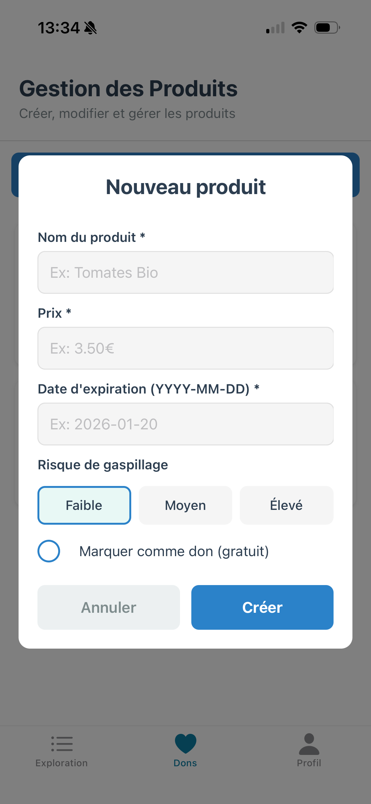

**I4 : Firebase Console - Collection products**
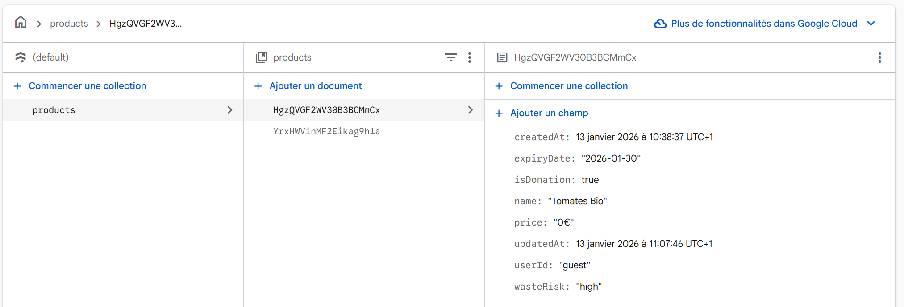

---

## 2. Réponses aux Questions de Validation

### Question 1 — Firebase Firestore vs API REST

Firestore est une base de données NoSQL orientée documents qui permet une synchronisation en temps réel et une gestion native du mode hors ligne. Contrairement à une API REST classique qui nécessite la création d'échanges de requêtes/réponses HTTP (GET, POST, etc.) sur un serveur intermédiaire, Firestore permet de lire et d'écrire directement depuis le client (Mobile/Web). On utilise Firestore pour sa rapidité de développement, sa scalabilité automatique et ses capacités de synchronisation en temps réel (WebSockets).

### Question 2 — Async/Await vs Promises

`async/await` est un "sucre syntaxique" construit sur les Promises. Il permet d'écrire du code asynchrone qui ressemble à du code synchrone, ce qui le rend beaucoup plus lisible et facile à déboguer par rapport aux chaînes de `.then()`. 

**Exemple Firestore :**
```tsx
// Avec .then()
getDocs(collection(db, "products")).then(snapshot => console.log(snapshot.docs));

// Avec async/await
const snapshot = await getDocs(collection(db, "products"));
console.log(snapshot.docs);
```

### Question 3 — Gestion d'erreurs

La gestion d'erreurs est cruciale dans les flux asynchrones car de nombreux facteurs externes peuvent faire échouer la requête : perte de connexion internet, règles de sécurité Firebase refusées, ou jeton d'authentification expiré. Sans `try/catch`, une erreur asynchrone peut faire planter l'application ou laisser l'interface utilisateur dans un état "chargement" infini.

**Exemple :**
```tsx
try {
  await deleteDoc(doc(db, "products", id));
  Alert.alert("Succès", "Produit supprimé");
} catch (error) {
  console.error("Erreur lors de la suppression:", error);
  Alert.alert("Erreur", "Impossible de supprimer le produit.");
}
```

---

## 3. Bilan de Validation

### Configuration Firebase
- [x] Firebase installé (`npm install firebase`)
- [x] Fichier `firebase.ts` créé et configuré
- [x] Variables d'environnement Firebase configurées (`.env`)
- [x] Firestore initialisé correctement
- [x] Règles de sécurité Firestore configurées
- [x] Collection `products` créée dans Firebase Console

### Service Produits & CRUD
- [x] `productsService.ts` créé avec isDonation
- [x] `useProducts.ts` hook créé
- [x] DonationsScreen permet de créer un produit
- [x] DonationsScreen permet de modifier/supprimer des produits
- [x] Fonction `markProductAsDonation()` fonctionnelle
- [x] **5 produits de test ajoutés** via le formulaire CRUD
- [x] **2 produits marqués comme donation** (`isDonation: true`)

### Affichage dans ProductsScreen
- [x] ProductsScreen affiche les produits depuis Firestore
- [x] Badge "En don" affiché sur les produits avec `isDonation: true`
- [x] `useProducts` intégré dans ProductsScreen
- [x] ProductCard accepte la prop `isDonation?: boolean`

### Fonctionnalités TD2/TD3 Conservées
- [x] Navigation Stack fonctionne
- [x] Navigation Tabs fonctionne
- [x] Favoris fonctionnent avec produits Firestore
- [x] Recherche et filtres fonctionnent

### Qualité
- [x] Pas d'erreurs console
- [x] Code propre et typé (TypeScript)
- [x] Gestion asynchrone propre (async/await)
- [x] Architecture Clean respectée
